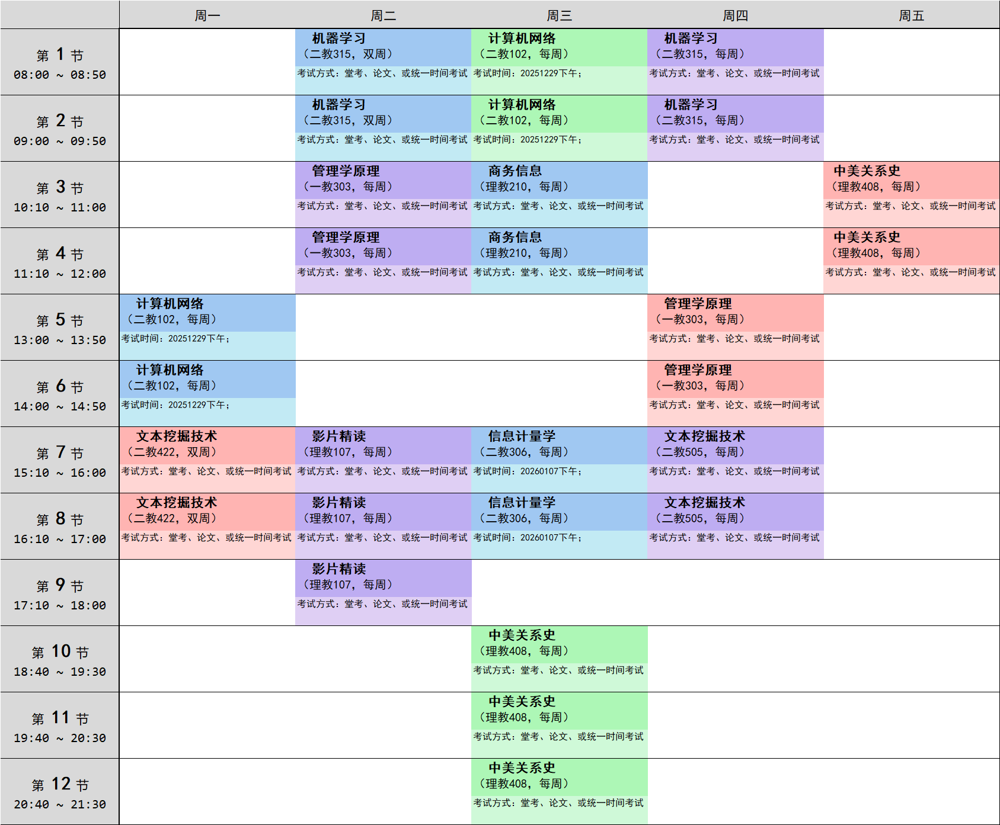

# pku-elective-prettify

## How to use
1. Put `schedule.xls` downloaded from [选课结果](elective.pku.edu.cn) into `input` folder
2. Run:
```bash
pip install uv
uv run tui.py
```
3. Take result from `output` folder


---
## Sample result


